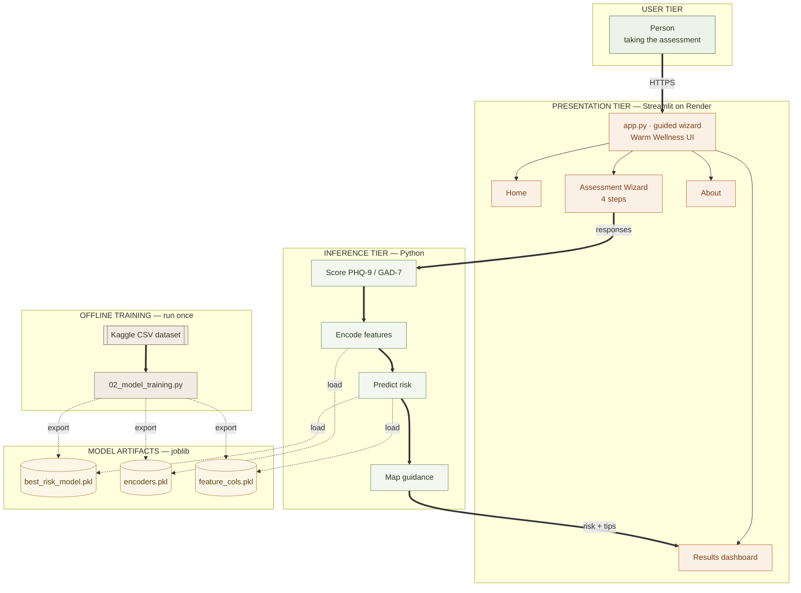
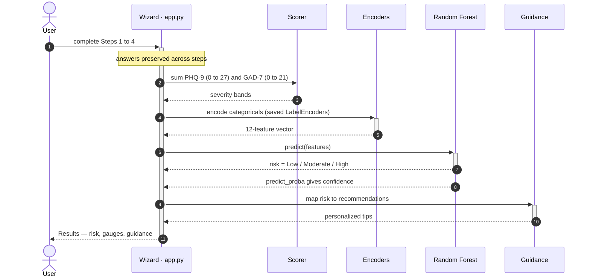
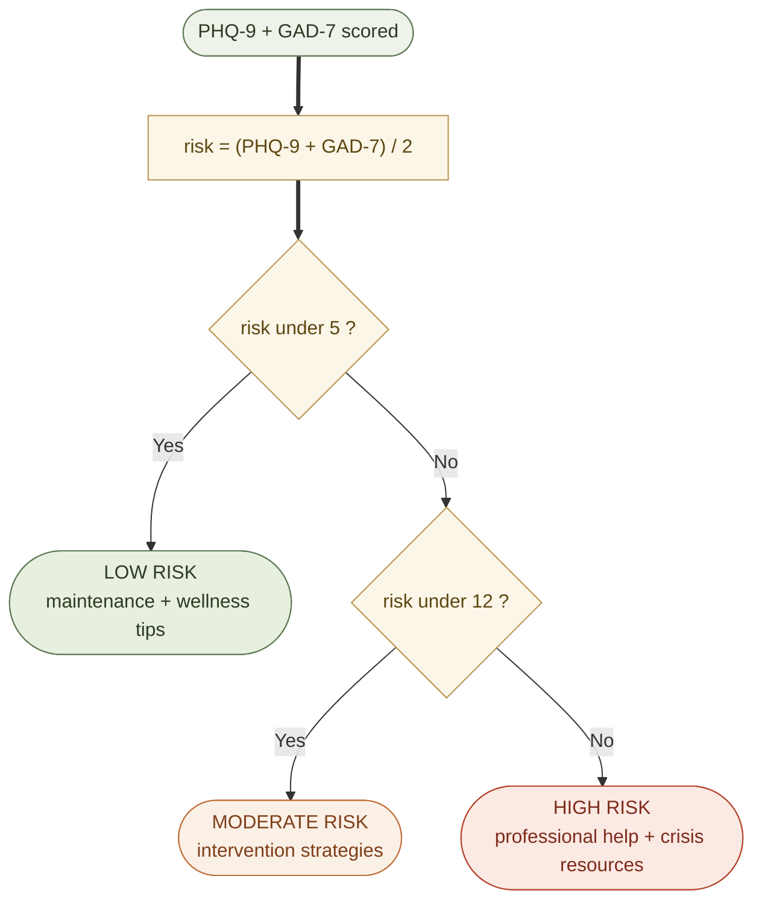

<div align="center">

# 🧠 MindScope-2025

### AI-Powered Mental Wellbeing Assessment

*An end-to-end machine learning application that turns clinically validated depression and anxiety screening into a calm, guided, and explainable risk assessment.*


</div>

> **MindScope-2025** combines the **PHQ-9** (depression) and **GAD-7** (anxiety) screening instruments with a trained **Random Forest** classifier to deliver a confidential, evidence-based reflection on mental wellbeing — wrapped in a polished, guided, step-by-step web experience.

---

## 📑 Table of Contents

1. [Overview](#-overview)
2. [Flow at a Glance](#-flow-at-a-glance)
3. [Key Features](#-key-features)
4. [System Architecture](#-system-architecture)
5. [Core Flows](#-core-flows)
7. [Clinical Scales & Risk Logic](#-clinical-scales--risk-logic)
8. [Dataset](#-dataset)
9. [Machine Learning](#-machine-learning)
10. [Technology Stack](#-technology-stack)
11. [Project Structure](#-project-structure)
12. [Getting Started](#-getting-started)
13. [Usage & Test Cases](#-usage--test-cases)
14. [Personalized Guidance](#-personalized-guidance)
15. [Roadmap](#-roadmap)
16. [Privacy & Security](#-privacy--security)
17. [Disclaimers & Crisis Resources](#-disclaimers--crisis-resources)
18. [Resources](#-resources)
19. [License](#-license)

---

## 🌍 Overview

MindScope-2025 is a complete demonstration of the **machine learning lifecycle** — from raw data to a deployed, user-facing product:

> **Data acquisition → cleaning → exploratory analysis → modeling → serialization → application → containerization → cloud deployment.**

Rather than stopping at a notebook, the project ships a **production web app**. A user answers a short, guided questionnaire; the app scores their responses against standardized clinical thresholds, feeds an engineered feature vector to a trained model, and returns a **risk band (Low / Moderate / High)** with a confidence score and **personalized, actionable guidance**.

The interface is intentionally calm — a *Warm Wellness* design system with a guided wizard — because the subject matter is sensitive and the goal is reflection, not alarm.

---

## 🗺️ Flow at a Glance

A single end-to-end view of the project — from the public dataset (offline modeling) all the way to a live prediction in the user's browser. This text diagram renders everywhere, including plain Markdown viewers.

```text
        ╔══════════════════════════════════════════╗
        ║M I N D S C O P E   data > model > decision║
        ╚══════════════════════════════════════════╝

   PHASE 1  —  DATA SCIENCE & MODELING   (offline, run once)

   ┌──────────────────────────────────────┐
   │        Kaggle Dataset  (CSV)         │   Global Mental Health 2025
   └──────────────────────────────────────┘
                       │
                       ▼
   ┌──────────────────────────────────────┐
   │          Clean + Preprocess          │   pandas · numpy
   └──────────────────────────────────────┘
                       │
                       ▼
   ┌──────────────────────────────────────┐
   │            EDA + Insights            │   Jupyter notebook
   └──────────────────────────────────────┘
                       │
                       ▼
   ┌──────────────────────────────────────┐
   │         Feature Engineering          │   encode + clinical thresholds
   └──────────────────────────────────────┘
                       │
                       ▼
   ┌──────────────────────────────────────┐
   │       Train + Compare 3 Models       │   LogReg · Decision Tree · Forest
   └──────────────────────────────────────┘
                       │
                       ▼
   ┌──────────────────────────────────────┐
   │       Select + Save Best Model       │   joblib .pkl  ->  Random Forest
   └──────────────────────────────────────┘
                       │
                       ▼
   PHASE 2  —  APPLICATION & INFERENCE   (every user session)

   ┌──────────────────────────────────────┐
   │          User Opens Web App          │   Streamlit · Docker · Render
   └──────────────────────────────────────┘
                       │
                       ▼
   ┌──────────────────────────────────────┐
   │         Guided 4-Step Wizard         │   Basics > PHQ-9 > GAD-7 > Lifestyle
   └──────────────────────────────────────┘
                       │
                       ▼
   ┌──────────────────────────────────────┐
   │     Encode -> 12-Feature Vector      │
   └──────────────────────────────────────┘
                       │
                       ▼
   ┌──────────────────────────────────────┐
   │      Predict Risk + Confidence       │   Random Forest model
   └──────────────────────────────────────┘
                       │
                       ▼
   ┌──────────────────────────────────────┐
   │     Risk:  Low / Moderate / High     │
   └──────────────────────────────────────┘
                       │
                       ▼
   ┌──────────────────────────────────────┐
   │   Results + Personalized Guidance    │
   └──────────────────────────────────────┘
```

---

## ✨ Key Features

| Capability | Description |
|---|---|
| 🩺 **Clinically grounded** | Built on validated PHQ-9 and GAD-7 instruments with standard severity thresholds |
| 🤖 **Explainable ML** | Random Forest risk classifier with a transparent, reproducible training pipeline |
| 🧭 **Guided wizard** | A four-step assessment (Basics → Depression → Anxiety → Lifestyle) with live scoring |
| 📊 **Visual results** | Risk banner, metric cards, and interactive PHQ-9 / GAD-7 gauges |
| 💬 **Personalized guidance** | 65+ tailored recommendations mapped to the assessed risk level |
| 🔒 **Privacy-first** | Session-only processing — nothing is stored, tracked, or transmitted to third parties |
| 🐳 **Portable & deployed** | Containerized with Docker and deployed on Render |

---

## 🏗️ System Architecture

> Thick arrows are the primary user path; dotted arrows load the trained model artifacts. Each tier is colour-coded.



---

## 🔄 Core Flows

### 1. Machine Learning Lifecycle — training path

```mermaid
flowchart LR
    A(["Kaggle Dataset<br/>Global Mental Health 2025"]) ==> B["Clean + Preprocess<br/>pandas · numpy"]
    B ==> C["EDA + Insights<br/>Jupyter"]
    C ==> D["Feature Engineering<br/>encode + clinical thresholds"]
    D ==> E{{"Train + Compare<br/>LogReg · Tree · Forest"}}
    E ==> F["Select Best<br/>Random Forest"]
    F ==> G[("Serialize .pkl<br/>joblib")]
    G ==> H(["Deployed app<br/>Docker · Render"])

    classDef start fill:#EEF3E9,stroke:#5F7A57,color:#2E3A24
    classDef proc fill:#F3F7EF,stroke:#7C9473,color:#2E3A24
    classDef task fill:#FBF0E6,stroke:#C2703D,color:#7E3F1A
    classDef store fill:#FCF6E9,stroke:#B8924A,color:#5C4710
    classDef ok fill:#E7F0DF,stroke:#5F7A57,color:#2E3A24

    class A start
    class B,C,D,F proc
    class E task
    class G store
    class H ok
```



**Stage-by-stage explanation**

| # | Stage | What happens | Tools |
|---|---|---|---|
| 1 | **Data Acquisition** | Source the *Global Mental Health Dataset 2025* (synthetic, patient-level records) from Kaggle. | Kaggle |
| 2 | **Cleaning & Preprocessing** | Handle missing values (median/mode imputation), normalize types, and validate ranges. | pandas, numpy |
| 3 | **Exploratory Data Analysis** | Examine distributions, correlations (PHQ-9 vs GAD-7), and lifestyle relationships to surface insight. | Jupyter, matplotlib, seaborn |
| 4 | **Feature Engineering** | Derive `Depression_Level`, `Anxiety_Level`, and `Risk_Level` from clinical thresholds; encode categoricals with `LabelEncoder`. | scikit-learn |
| 5 | **Model Training** | Train and compare three classifiers under a fixed train/test split. | scikit-learn |
| 6 | **Model Selection** | Select the best performer by test accuracy — **Random Forest**. | scikit-learn |
| 7 | **Serialization** | Persist the model, encoders, and feature schema as `.pkl` artifacts for fast inference. | joblib |
| 8 | **Application** | Serve a guided, interactive assessment that loads the artifacts and runs predictions. | Streamlit |
| 9 | **Containerization** | Package the app and its dependencies into a reproducible image. | Docker |
| 10 | **Deployment** | Publish the container as a public web service. | Render |

### 2. Assessment & Prediction — inference path



The model consumes a **12-feature vector**:

`Age` · `Gender` · `Depression_Score (PHQ-9)` · `Anxiety_Score (GAD-7)` · `Stress_Level` · `Sleep_Hours` · `Physical_Activity` · `Chronic_Illness` · `Mental_Health_History` · `Treatment` · `Days_of_Treatment` · `Work_Status`

> 🛡️ **Robust by design:** encoding falls back gracefully for inclusive options not present in the training set (e.g. additional gender or work-status choices), so the app never crashes on valid user input.

### 3. Risk Decision Logic



---

## 📐 Clinical Scales & Risk Logic

### PHQ-9 — Depression Severity

| Score | Level |
|---|---|
| 0–4 | Minimal |
| 5–9 | Mild |
| 10–14 | Moderate |
| 15–19 | Moderately Severe |
| 20–27 | Severe |

### GAD-7 — Anxiety Severity

| Score | Level |
|---|---|
| 0–4 | Minimal |
| 5–9 | Mild |
| 10–14 | Moderate |
| 15–21 | Severe |

### Combined Risk Level

The training labels (and the model's target) are derived from the mean of the two scores:

```text
risk_value = (Depression_Score + Anxiety_Score) / 2

risk_value < 5    → Low
5 ≤ risk_value < 12 → Moderate
risk_value ≥ 12   → High
```

---

## 📊 Dataset

| Property | Detail |
|---|---|
| **Source** | Global Mental Health Dataset 2025 (Kaggle) |
| **Type** | Synthetic, patient-level records |
| **Volume** | 2,500+ samples |
| **Features** | Demographic + clinical + lifestyle indicators |
| **Targets** | Depression Level, Anxiety Level, Risk Level (engineered) |
| **Use** | Educational and research purposes only |

**Raw features:** Age, Gender, Country, Depression_Score, Anxiety_Score, Stress_Level, Sleep_Hours, Physical_Activity, Chronic_Illness, Mental_Health_History, Treatment, Days_of_Treatment, Work_Status, Outcome.

---

## 🤖 Machine Learning

### Models Compared

| Model | Role | Approx. Test Accuracy |
|---|---|---|
| Logistic Regression | Linear baseline | ~78% |
| Decision Tree | Interpretable | ~82% |
| **Random Forest** | **Selected model** | **~85%** |

### Selected Model Performance

```text
Best Model: Random Forest Classifier
━━━━━━━━━━━━━━━━━━━━━━━━━━━━━━━━━━━━━━
Train Accuracy : 95.2%
Test Accuracy  : 85.3%
Precision      : 0.84
Recall         : 0.85
F1-Score       : 0.84
```

**Evaluation:** Accuracy, Precision, Recall, F1-Score, and Confusion Matrix — used to compare models and select the strongest, most generalizable approach.

---

## 🧰 Technology Stack

| Layer | Technology |
|---|---|
| **Web / UI** | Streamlit, custom CSS design system, Phosphor Icons, Plotly |
| **Language** | Python 3.8+ |
| **ML Framework** | scikit-learn (Random Forest, Logistic Regression, Decision Tree) |
| **Data** | pandas, numpy |
| **Notebooks / EDA** | Jupyter, matplotlib, seaborn |
| **Serialization** | joblib |
| **Packaging** | Docker |
| **Deployment** | Render |

---

## 🗂️ Project Structure

```text
MindScope-2025/
├─ Data/
│  ├─ 01_Data_Cleaning.ipynb              # cleaning + EDA notebook
│  └─ Global_Mental_Health_Dataset_2025.csv
│
├─ models/                               # generated by the training script
│  ├─ best_risk_model.pkl                # selected (Random Forest) classifier
│  ├─ random_forest_model.pkl
│  ├─ encoders.pkl                       # saved LabelEncoders
│  └─ feature_cols.pkl                   # feature schema / order
│
├─ 02_model_training.py                  # trains, compares, and serializes models
├─ app.py                                # Streamlit application (guided wizard)
├─ Dockerfile                            # container definition
├─ requirements.txt
├─ .streamlit/config.toml                # theme configuration
└─ README.md
```

---

## 🚀 Getting Started

### Prerequisites
- Python 3.8+
- `pip`

### 1. Clone & install

```bash
git clone https://github.com/haroontrailblazer/MindScope-2025.git
cd MindScope-2025
pip install -r requirements.txt
```

### 2. (Optional) Retrain the models

The trained artifacts are included in `models/`. To regenerate them from the dataset:

```bash
python 02_model_training.py
```

### 3. Run the app

```bash
streamlit run app.py
```

Then open the local URL shown in your terminal (default `http://localhost:8501`).

### 🐳 Run with Docker

```bash
docker build -t mindscope .
docker run -p 8501:8501 mindscope
```

### ☁️ Deploy on Render

This repository is deployment-ready. Create a new **Web Service** on Render, point it at the repo, and select the **Docker** runtime — the included `Dockerfile` handles the rest.

> **Live demo:** `https://<your-app>.onrender.com` *(replace with your deployed URL)*

---

## 🧪 Usage & Test Cases

| Scenario | PHQ-9 | GAD-7 | Expected Result |
|---|---|---|---|
| **Low Risk** | ~2 | ~3 | Low Risk → maintenance & wellness tips |
| **Moderate Risk** | ~12 | ~10 | Moderate Risk → intervention strategies |
| **High Risk** | ~24 | ~18 | High Risk → professional help + crisis resources |

---

## 💬 Personalized Guidance

Recommendations adapt to the assessed risk level:

| Risk | Categories | Focus |
|---|---|---|
| **Low** | 4 | Physical activity, sleep, mental wellness, lifestyle |
| **Moderate** | 5 | Activity, sleep, social support, stress management, professional help |
| **High** | 5 | Immediate actions, professional treatment, crisis support, daily wellness, self-care |

---

## 🗺️ Roadmap

**Completed**
- [x] PHQ-9 & GAD-7 guided screening wizard
- [x] ML training pipeline with model comparison & selection
- [x] Risk prediction with confidence score
- [x] Personalized recommendation engine
- [x] Visual results dashboard (gauges + metric cards)
- [x] Crisis resources & disclaimers
- [x] Dockerized deployment on Render

**Planned**
- [ ] Dedicated EDA & model-analysis notebooks
- [ ] Cross-validation & calibration studies
- [ ] Assessment history & PDF report export
- [ ] Multi-language support (Hindi, Tamil)
- [ ] Wearable integration (Apple Health, Fitbit)

---

## 🔐 Privacy & Security

- **Local, session-based processing** — assessments are computed in-session for the result only
- **No storage** — responses are not persisted
- **No third-party transmission** and **no tracking cookies**
- Assessments are **anonymous**

---

## ⚠️ Disclaimers & Crisis Resources

> **MindScope-2025 is an educational self-assessment tool. It is NOT a medical device, NOT a diagnosis, and NOT a substitute for evaluation by a licensed mental health professional.** The model is trained on a synthetic dataset.

**If you are in crisis, please reach out immediately:**

- 🚨 Emergency Services: **911 (US)** | **112 (India)**
- ☎️ Suicide & Crisis Lifeline: **988 / 1-800-273-8255 (US)**
- 💬 Crisis Text Line: **Text HOME to 741741**
- 🇮🇳 AASRA / Befrienders (India): **9152987821**

---

## 📚 Resources

**Assessment Scales**
- [PHQ-9 Screeners](https://www.phqscreeners.com/)
- [GAD-7 (ADAA)](https://adaa.org/gad-7)

**Mental Health Organizations**
- [WHO — Mental Health](https://www.who.int/teams/mental-health-and-substance-use)
- [NAMI (USA)](https://www.nami.org/)
- [MIND (UK)](https://www.mind.org.uk/)

**Technical**
- [Streamlit Docs](https://docs.streamlit.io/)
- [scikit-learn](https://scikit-learn.org/)
- [Plotly](https://plotly.com/python/)

---

## 📄 License

This project is open-source. See [`LICENSE`](./LICENSE) for details.

---

<div align="center">

**Built by [Haroon K M](https://haroontrailblazer.vercel.app)** ·
[GitHub](https://github.com/haroontrailblazer) ·
[Instagram](https://www.instagram.com/hendrix__trailblazer)

*Last updated: June 17, 2026 · Version 2.0.0*

</div>
